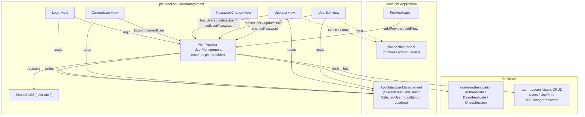
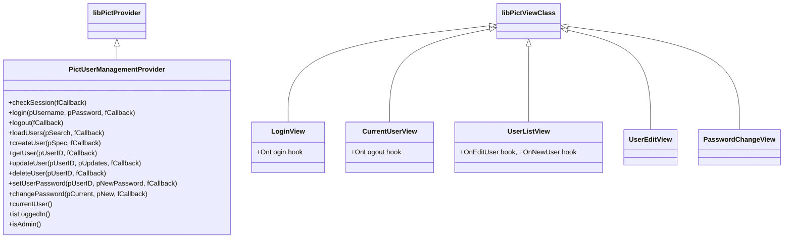
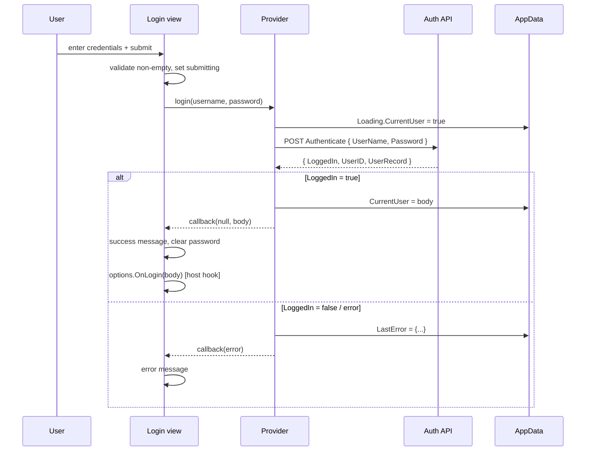

# Architecture

Pict Section UserManagement is a **provider + five views**. The provider (`Pict-Provider-UserManagement`) owns every network call and writes results into `pict.AppData.UserManagement`. The views are thin: they render from `AppData`, collect input, and call provider methods. No view fetches on its own.

## Component Map



## Class Hierarchy



Every view resolves the provider by hash (`options.ProviderHash`, default `Pict-UserManagement-Provider`) via `this.pict.providers[...]`.

## The AppData Contract

The provider seeds `pict.AppData.UserManagement` synchronously in its constructor so views that mount before the first fetch render an empty-but-valid state:

```javascript
pict.AppData.UserManagement =
{
	CurrentUser:  { LoggedIn: false },           // or { LoggedIn:true, UserID, UserRecord:{...} }
	AllUsers:     [],                             // [ { UserID, Username, Roles, Email, ... }, ... ]
	SelectedUser: null,                           // user being edited
	LastError:    null,                           // { Action, Message, Status, Reason }
	Loading:      { CurrentUser:false, AllUsers:false, Mutating:false }
};
```

| Key | Written by | Read by |
|---|---|---|
| `CurrentUser` | `checkSession`, `login`, `logout` | CurrentUser view, host auth gate, `isLoggedIn` / `isAdmin` |
| `AllUsers` | `loadUsers` | UserList view |
| `SelectedUser` | `getUser`; UserList's Edit action | UserEdit view |
| `CreateMode` | UserList's "New user" action (when no `OnNewUser` hook) | UserEdit view |
| `LastError` | any failed call | host error UI (optional) |
| `Loading` | every call (start/finish) | host spinners (optional) |

After updating `AppData`, the provider calls a best-effort `pict.store.set('UserManagement.<key>', value)` so hosts wired with a Pict store get auto-rerender. When no store is present, the host re-renders views explicitly (the bundled demo does this).

## REST Surface

Every path is appended to `options.BaseURL` (default `/1.0/`). The provider sends `credentials: 'same-origin'` so the session cookie rides along, `Accept: application/json`, and `Content-Type: application/json` on requests with a body.

| Provider method | HTTP | Path | Source |
|---|---|---|---|
| `checkSession()` | `GET` | `CheckSession` | orator-authentication |
| `login(u, p)` | `POST` | `Authenticate` — body `{ UserName, Password }` | orator-authentication |
| `logout()` | `POST` | `Deauthenticate` | orator-authentication |
| `loadUsers(search)` | `GET` | `Users` (optional `?search=`) | auth-beacon |
| `createUser(spec)` | `POST` | `Users` | auth-beacon |
| `getUser(id)` | `GET` | `User/:id` | auth-beacon |
| `updateUser(id, updates)` | `PUT` | `User/:id` | auth-beacon |
| `deleteUser(id)` | `DELETE` | `User/:id` | auth-beacon |
| `setUserPassword(id, pw)` | `POST` | `User/:id/SetPassword` — body `{ NewPassword }` | auth-beacon |
| `changePassword(cur, new)` | `POST` | `Me/ChangePassword` — body `{ CurrentPassword, NewPassword }` | auth-beacon |

### Response shapes the provider expects

- **`CheckSession` / `Authenticate`** — `{ LoggedIn: true, UserID, UserRecord: { LoginID, IDUser, Roles, FullName, Email } }`. Anything without `LoggedIn: true` is treated as not-logged-in. On `Authenticate`, a falsy `LoggedIn` with an `Error` string surfaces as a login failure.
- **`Users` (GET)** — `{ Users: [ ... ] }`. The array is stored at `AllUsers`; a missing array becomes `[]`.
- **`User/:id` (GET)** — `{ User: {...} }`. Stored at `SelectedUser`.
- **Mutations** — the body is passed back through the callback. UserEdit additionally treats `{ Success: false, Reason }` as a failure even on a 2xx response.

### Error handling

`_call` builds an `Error` whenever the response is not ok (`status >= 400` or `ok === false`), attaching `status` and the parsed `body`. The error's message prefers `body.Reason` or `body.Error`, falling back to `HTTP <status>`. Every public method also records the failure to `AppData.UserManagement.LastError` as `{ Action, Message, Status, Reason }`.

`logout()` always clears the local session (`CurrentUser = { LoggedIn: false }`) even if the network call fails — the user asked to sign out, so they should never be stuck with a stale badge.

## Login Request Flow



## Transport Injection

The provider resolves its transport once, in the constructor:

1. `options.Fetcher` if it is a function.
2. Otherwise `globalThis.fetch` (bound), when available.
3. Otherwise `null` — calls reject with a clear "no Fetcher available" error.

A `Fetcher` is any callable `(path, opts) => Promise<{ ok, status, json() }>`. This is the seam the bundled demo uses to run against an in-browser mock with no backend, and it is how tests inject a stub. In production the default `fetch` path is correct; you only set `Fetcher` to mock or to wrap the transport.

## Session Storage Policy

The module stores no tokens in `localStorage` or `sessionStorage`. Sessions are assumed to be carried by the backend's session cookie (every request uses `credentials: 'same-origin'`), and `checkSession()` re-establishes state on load. Refreshing the page therefore depends entirely on the backend cookie; the demo's in-memory mock has no real cookie jar, so refreshing it logs you out.

## Rendering Notes

These views were written against a backend that returns user-controlled strings (usernames, full names, emails, error reasons). To keep those safe in the DOM, the views build their dynamic content with `document.createElement` + `textContent` (and HTML-escape values that must go into attribute context) rather than interpolating into `innerHTML`. The CurrentUser badge, UserList table rows, and the inline message strips all follow this pattern. Form-submit and button behavior is wired in `onAfterRender` with `addEventListener`, guarded by a `_pictUMWired` flag (or rebuilt each render) so re-rendering does not double-bind. CSS is injected via `this.pict.CSSMap.injectCSS()` in each view's `onAfterRender`.

## File Layout

```
pict-section-usermanagement/
├── README.md
├── package.json
├── source/
│   ├── Pict-Section-UserManagement.js          # entry point: named exports + install()
│   ├── Pict-Provider-UserManagement.js         # REST provider + AppData writes
│   ├── Pict-Provider-UserManagement-CSS.js     # shared .pict-um-* stylesheet
│   └── views/
│       ├── PictView-UserManagement-Login.js
│       ├── PictView-UserManagement-CurrentUser.js
│       ├── PictView-UserManagement-UserList.js
│       ├── PictView-UserManagement-UserEdit.js
│       └── PictView-UserManagement-PasswordChange.js
├── example_applications/
│   └── usermanagement_demo/                     # full demo + in-browser mock backend + smoke.js
└── docs/
    ├── README.md, _cover.md, _sidebar.md
    ├── quickstart.md
    ├── architecture.md
    └── api-and-usage.md
```
